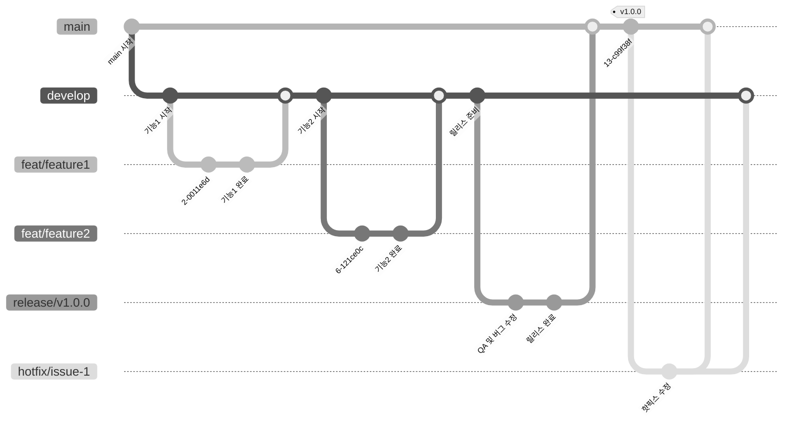

# 🚀 프로젝트 이름

<p align="center">
  
</p>

<!-- 이미지 추가 및 수정 예정 -->

> 멸망하지 않게 조심하세요

[]()
[]()
[]()

---

## 📱 소개

> tabularML

[🔗 앱스토어/웹 링크](https://example.com)


## 📆 프로젝트 기간
- 전체 기간: `2025.06.23 - 2025.08.01`
- 개발 기간: `2025.07.10 - 2025.07.29`


## 🛠 기술 스택

<!-- iOS -->
[]()
[]()
[]()

<!-- Architecture -->
[]()
[]()
[]()

<!-- Tools -->
[]()
[]()
[]()


## 🌟 주요 기능

- createML, linear regression을 통해 사용자 집중력 점수 제공
- 집중력 점수에 따라 상대적인 시간 흐름 표현


## 🖼 화면 구성 및 시연
추후 업데이트 예정

<!--| 기능 | 설명 | 이미지 |
|------|------|--------|
| 예시1 | 기능 요약 |  |
| 예시2 | 기능 요약 |  |-->


## 🧱 폴더 구조

```
📁 NoMyeolmang Project
├── 📁 AppName (iOS 그룹)
│   ├── App/
│   ├── Presentations/
│   ├── Models/
│   ├── Services/
│   ├── ML/
│   ├── Core/
│   └── Resources/
│
├── 📁 Watch App (watchOS 그룹)
│   ├── App/
│   ├── Presentations/
│   ├── Models/
│   ├── Services/
│   └── Resources/
│
└── 📁 Shared (공통 그룹)
		├── Models/
		├── Services/
		└── Extensions/
```


## 🧑‍💻 팀 소개

<h3 align="center"> 멸망하지 않게 조심해. </h3>
<p align="center"> 이번에 멸망하면 지난 아카데미 생활이 모두 부정당하게 되는, 절대 멸망해선 안되는 팀입니다. </p>

<div align="center">
  <table>
    <tr>
      <td align="center" style="padding: 0 20px;">
        <a href="https://github.com/legnasy">
          <br/>
          <b>Angie</b>
        </a>
      </td>
      <td align="center" style="padding: 0 20px;">
        <a href="https://github.com/ohdodin">
          <br/>
          <b>Dodin</b>
        </a>
      </td>
      <td align="center" style="padding: 0 20px;">
        <a href="https://github.com/romiwaves">
          <br/>
          <b>Gabi</b>
        </a>
      </td>
      <td align="center" style="padding: 0 20px;">
        <a href="https://github.com/MuchanKim">
          <br/>
          <b>Moo</b>
        </a>
      </td>
      <td align="center" style="padding: 0 20px;">
        <a href="https://github.com/wish627">
          <br/>
          <b>Wish</b>
        </a>
      </td>
    </tr>
  </table>
</div>

## 🔖 브랜치 전략
```plaintext
[레이블]/#[이슈번호]/[작업내용]
작업 내용은 단어가 2개 이상이면 -(dash)로 구분하고 소문자로만 작성합니다.
반드시 이슈 번호를 확인할 것!
```

| 타입 | 설명 |
|------|-------------------------|
| feat | 기능 개발 |
| fix | 버그 수정 |
| refactor | 리팩토링 |
| docs | 문서 변경 |
| chore | 설정, 테스트 등 잡작업 |



## 🌀 커밋 메시지 컨벤션
```plaintext
[타입]: #[이슈번호] [간단한 작업 요약]
- Description
```

## 🏷️ Issue/PR Labels

| 이모지 | 기능 | 설명 |
|--------|------|------|
| 🛠️ | Chore | 간단한 코드수정, 파일수정, 주석 등 기능 단위라고 판단하기 애매한 작업 |
| 🐞 | Bug | 무언가가 부러졌을 때 사용 |
| ❌ | Delete | 파일 변경/삭제 할 때 |
| 📝 | Docs | 문서화가 필요할 때 |
| ✨ | Feature | 기능(UI/로직) 추가 할 때 |
| ⚙️ | Setting | 프로젝트 설정 관련, 코드 변경 X |
| 🪓 | Refactor | 코드 리팩토링. 구조 개선, 기능 변경은 없음 |
| 🙌 | help wanted | 누군가의 도움이 필요할 때 |


## ✅ 테스트 방법

1. 이 저장소를 클론합니다.
```bash
git clone https://github.com/DeveloperAcademy-POSTECH/2025-C4-M9-NoMyeolmang.git
```
2. `Xcode`로 `.xcodeproj` 또는 `.xcworkspace` 열기
3. 시뮬레이터 환경 설정: iPhone 15 / iOS 17
4. `Cmd + R`로 실행 / `Cmd + U`로 테스트 실행


## 📎 프로젝트 문서

- [기획 히스토리](링크)
- [디자인 히스토리](링크)
- [기술 문서 (아키텍처 등)](링크)


## 📝 License

This project is licensed under the ~~[CHOOSE A LICENSE](https://choosealicense.com). and update this line~~
